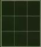
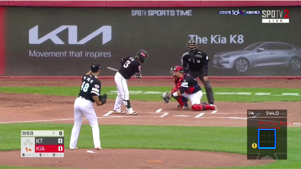
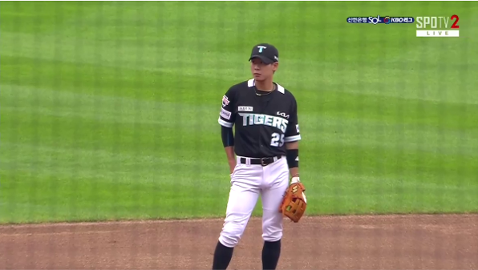
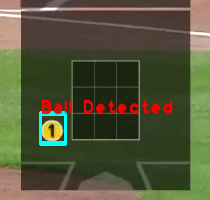
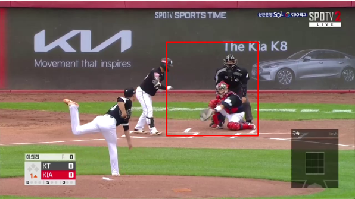
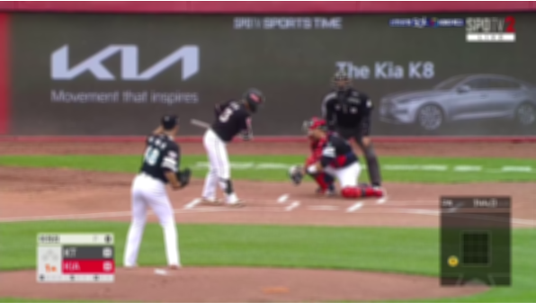

# KBO Baseball Dataset

In baseball, the umpire's strike-zone judgment is often controversial. Misjudgment in strike calls can make significant consequences to reverse the run of the game. To track the umpire's misjudgment and its effect, ground truth for strike-ball determination and actual call for that ball are required.

In this project, we collect pitching dataset from the KBO league broadcast. We collect the pitching board and umpire's call on that ball. The collected data are used to analyze the umpire's misjudgment and anticipate the impact on the game.

The dataset collected from this project is as follows.
1. Pitching Board
2. Ground Truth for strike-ball determination
3. Umpire's Call


##  1. Save broadcast video with key-frames using template matching algorithm.
Key-frames in the broadcast video are: 
* Frame with pitching board
    
     
     
     Key-frame: Broadcast video with pitching board
	 
	 

     Not Key-frame: Broadcast video without pitching board
     

* Frame when a new ball is thrown

     
      
     Key-frame: Broadcast video with a new ball thrown
    
     

## 2. Generate ground truth for strike-ball determination
```json
{
	"10": {
		"strike_zone_roi": [
			490,
			1030,
			690,
			1240
		],
		"umpire_roi": [
			900,
			600,
			490,
			150
		],
		"gt": 0,
		"file_names": [
			"./key_frames/key-frame10-0.png",
			"./key_frames/key-frame10-1.png",
			"./key_frames/key-frame10-2.png",
			"./key_frames/key-frame10-3.png",
			"./key_frames/key-frame10-4.png"
		]
	}
}
```

## 3. Collect the umpire's call for the ball.


## 4. Dataset augmentation by adding motion blur


## How to Run
to test the proposed network, run following code
```shell
python data_processing.py \
    --input_video /path/to/your/video \
    --output_json /path/to/output/json \
    --output_dir /path/to/output/image_directory \
    --template_pitching_board /path/to/pitching-board-template-image \
    --template_ball /path/to/ball-template-image
```